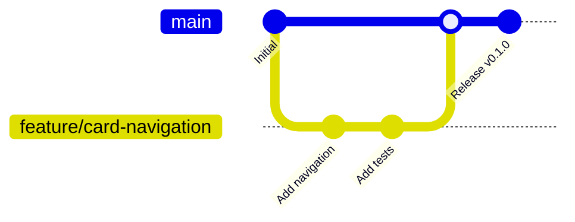

# CONTRIBUTING.md - 開發貢獻指南

> **團隊協作 | Git 流程 | 程式碼規範 | 開發最佳實踐**

歡迎參與背單字 MVP 專案開發！本指南將協助你快速融入開發流程。

---

## 📋 Table of Contents

1. [開發環境設定](#開發環境設定)
2. [Git 工作流程](#git-工作流程)
3. [分支策略](#分支策略)
4. [命名規則](#命名規則)
5. [程式碼風格](#程式碼風格)
6. [提交規範](#提交規範)
7. [Pull Request 流程](#pull-request-流程)
8. [測試要求](#測試要求)
9. [程式碼審查](#程式碼審查)

---

## 🛠 開發環境設定

### 必要工具
```bash
Node.js >= 18.0.0
npm >= 9.0.0 或 yarn >= 1.22.0
Git >= 2.30.0
VS Code (推薦) + 擴充套件
```

### VS Code 推薦擴充套件
```json
{
  "recommendations": [
    "bradlc.vscode-tailwindcss",
    "esbenp.prettier-vscode", 
    "dbaeumer.vscode-eslint",
    "ms-vscode.vscode-typescript-next",
    "orta.vscode-jest",
    "ms-vscode-remote.vscode-remote-extensionpack"
  ]
}
```

### 初次設定
```bash
# 1. Fork & Clone
git clone https://github.com/your-username/_vaca_app.git
cd _vaca_app

# 2. 安裝依賴
npm install

# 3. 設定 Git hooks (可選)
npm run prepare

# 4. 複製環境變數
cp .env.example .env.local

# 5. 執行開發伺服器
npm run dev

# 6. 執行測試確認環境
npm run test
```

### 環境變數設定

**Phase 1 MVP**: 使用 JSON fixtures，無需 API_BASE_URL
```bash
# .env.local (MVP階段可選)
# VITE_DEBUG=true  # 開啟除錯模式
```

**Phase 2+ 後端整合**:
```bash
# .env.local
VITE_API_BASE_URL=http://localhost:3001  # 本地開發
# VITE_API_BASE_URL=https://staging-api.example.com  # 測試環境
```

---

## 🔄 Git 工作流程

### 基本流程 (GitHub Flow 簡化版)



### 日常開發步驟
```bash
# 1. 同步主分支
git checkout main
git pull origin main

# 2. 建立功能分支
git checkout -b feature/card-flip-animation

# 3. 開發功能 (多次提交)
git add .
git commit -m "feat(card): add flip animation component"

# 4. 推送分支
git push origin feature/card-flip-animation

# 5. 建立 Pull Request
# 在 GitHub 介面操作

# 6. 審查通過後合併
# 由 Maintainer 操作

# 7. 清理本地分支
git checkout main
git pull origin main
git branch -d feature/card-flip-animation
```

---

## 🌳 分支策略

### 主要分支
- **`main`** - 生產版本，隨時可部署
- **`develop`** - 開發整合分支 (Phase 2 導入)

### 功能分支
- **命名**: `feature/功能描述`
- **生命週期**: 短期 (1-3天)
- **來源**: 從 `main` 分出
- **合併**: PR 到 `main`

### 特殊分支
- **`hotfix/問題描述`** - 緊急修復
- **`release/v1.0.0`** - 版本發布準備
- **`chore/工具更新`** - 工具鏈維護

### 分支保護規則
```yaml
main:
  - 需要 PR 審查
  - 需要通過 CI 檢查
  - 需要最新的 main 分支
  - 合併後自動刪除分支
```

---

## 📝 命名規則

### 檔案與目錄
```
Components:     PascalCase      Card.tsx, MediaEmbed.tsx
Hooks:          camelCase       useDueCards.ts, useReviewCard.ts  
Services:       camelCase       api.ts, srs.ts
Types:          camelCase       index.ts, cardTypes.ts
Tests:          *.test.ts(x)    Card.test.tsx, srs.test.ts
Fixtures:       camelCase       cardFixtures.json
Constants:      UPPER_CASE      API_BASE_URL, LEITNER_INTERVALS
```

### Git 分支
```
feature/功能描述         feature/card-navigation, feature/srs-algorithm
hotfix/問題描述          hotfix/memory-leak-fix, hotfix/cors-error  
chore/維護描述           chore/update-dependencies, chore/setup-ci
docs/文檔描述            docs/api-specification, docs/contributing-guide
```

### 變數與函式
```typescript
// 變數命名 - camelCase
const currentCardIndex = 0;
const isLoadingDueCards = false;
const apiResponseData = null;

// 函式命名 - 動詞開頭
const getDueCards = () => {};
const calculateNextReview = () => {};
const validateCardInput = () => {};

// 常數命名 - UPPER_CASE
const LEITNER_INTERVALS = [0, 1, 2, 3, 7, 14];
const MAX_RETRY_COUNT = 3;
const API_TIMEOUT_MS = 5000;

// 介面命名 - PascalCase + Props/Interface suffix  
interface CardProps {}
interface ApiResponseInterface {}
type ReviewQuality = 1 | 2 | 3;
```

### CSS Classes (Tailwind)
```html
<!-- 語意化命名，避免過度抽象 -->
<div class="card-container bg-white rounded-lg shadow-md">
  <div class="card-front p-4 text-center">
    <h2 class="word-text text-2xl font-bold">ubiquitous</h2>
  </div>
</div>
```

---

## 🎨 程式碼風格

### ESLint + Prettier 設定

**.eslintrc.js**
```javascript
module.exports = {
  extends: [
    '@typescript-eslint/recommended',
    'plugin:react/recommended', 
    'plugin:react-hooks/recommended',
    'prettier'
  ],
  rules: {
    'react/prop-types': 'off',           // TS 已提供型別檢查
    '@typescript-eslint/no-unused-vars': 'error',
    'prefer-const': 'error',
    'no-var': 'error'
  }
};
```

**.prettierrc**
```json
{
  "semi": true,
  "singleQuote": true,
  "tabWidth": 2,
  "trailingComma": "es5",
  "printWidth": 80,
  "bracketSpacing": true,
  "arrowParens": "avoid"
}
```

### TypeScript 規範
```typescript
// ✅ 優良寫法
interface CardProps {
  card: Card;
  onFlip(): void;
  onNext(): void;
}

const Card: React.FC<CardProps> = ({ card, onFlip, onNext }) => {
  const [currentFace, setCurrentFace] = useState<Face>('front');
  
  const handleKeyPress = useCallback((e: KeyboardEvent) => {
    // 邏輯實作
  }, []);

  return (
    <div className="card-container">
      {/* JSX 實作 */}
    </div>
  );
};

// ❌ 避免寫法
const Card = (props: any) => {        // 避免 any 型別
  let face = 'front';                 // 避免 let，優先 const
  
  function handleClick() {            // 優先使用 arrow function
    face = 'back';                    // 避免直接修改變數
  }
  
  return <div onClick={handleClick}>...</div>;
};
```

### React 組件規範
```typescript
// 檔案結構標準順序
import React from 'react';           // 1. React imports
import { useState } from 'react';

import { Card } from '@/types';       // 2. 型別 imports
import { useDueCards } from '@/hooks'; // 3. 自定義 hooks

import './Card.css';                 // 4. 樣式 imports (如需要)

// 5. 型別定義
interface CardProps {
  card: Card;
  onNext(): void;
}

// 6. 主要組件
const Card: React.FC<CardProps> = ({ card, onNext }) => {
  // 7. Hooks (狀態優先，效果其次)
  const [face, setFace] = useState<Face>('front');
  const { data: dueCards } = useDueCards();
  
  // 8. 事件處理函式
  const handleFlip = useCallback(() => {
    setFace(prev => prev === 'front' ? 'back' : 'front');
  }, []);
  
  // 9. 渲染邏輯
  return (
    <div className="card">
      {/* JSX 內容 */}
    </div>
  );
};

// 10. 預設匯出
export default Card;
```

### 測試風格
```typescript
// 檔案命名: ComponentName.test.tsx
import { render, screen, fireEvent } from '@testing-library/react';
import { vi } from 'vitest';            // 如使用 Vitest
import Card from '@/components/Card/Card';

// Arrange - Act - Assert 模式
describe('Card Component', () => {
  const mockCard = {
    id: 'test-1',
    word: { base: 'test', forms: [] },
    // ... 其他必要欄位
  };

  it('should display word on front face', () => {
    // Arrange
    const onNext = vi.fn();
    
    // Act  
    render(<Card card={mockCard} onNext={onNext} />);
    
    // Assert
    expect(screen.getByText('test')).toBeInTheDocument();
  });
});
```

---

## 📝 提交規範

### Conventional Commits 格式
```
<type>(<scope>): <description>

[optional body]

[optional footer(s)]
```

### 提交類型
- **feat**: 新功能
- **fix**: 錯誤修復  
- **docs**: 文檔更新
- **style**: 程式碼格式 (不影響功能)
- **refactor**: 程式碼重構
- **test**: 新增或修改測試
- **chore**: 建構流程或輔助工具變更

### 範例提交
```bash
git commit -m "feat(card): implement three-face navigation

Add keyboard shortcuts (← → Space) for card face switching.
Support Front/Meaning/Example face transitions.

Closes #12"

git commit -m "fix(api): handle network timeout errors

Add retry mechanism with exponential backoff.
Display user-friendly error messages.

Fixes #45"

git commit -m "test(srs): add comprehensive Leitner algorithm tests

Cover all quality ratings and edge cases.
Ensure interval calculation matches specification."

git commit -m "docs(readme): update quick start guide"

git commit -m "chore: update dependencies to latest stable versions"
```

### 提交頻率建議
- **功能開發**: 每完成一個小功能就提交
- **測試撰寫**: 測試與實作可分別提交  
- **修復 bug**: 一次提交完整修復
- **文檔更新**: 獨立提交，不與程式碼混合

---

## 🔍 Pull Request 流程

### PR 建立前檢查清單
- [ ] 程式碼遵循專案風格規範
- [ ] 所有測試通過 (`npm run test`)
- [ ] 型別檢查無錯誤 (`npm run type-check`)
- [ ] Linter 檢查通過 (`npm run lint`)
- [ ] 建構成功 (`npm run build`)
- [ ] 分支基於最新的 `main`

### PR 標題格式
```
[類型] 簡短描述 (關聯 Issue)

✅ 優良範例:
feat: implement card flip animation (#23)
fix: resolve CORS error in production (#45)  
docs: add API documentation for review endpoint
test: increase SRS algorithm test coverage

❌ 避免範例:
update code
fix bug  
improvements
```

### PR 描述模板
```markdown
## 🎯 變更描述
簡述此 PR 實作的功能或修復的問題

## 🔗 關聯 Issue  
Closes #123

## 🧪 測試情況
- [ ] 單元測試已新增/更新
- [ ] 手動測試已完成
- [ ] 覆蓋率無下降

## 📱 影響範圍
- [ ] 前端 UI/UX
- [ ] API 介面
- [ ] 資料模型
- [ ] 建構/部署流程

## 📸 螢幕截圖 (如適用)
[新增螢幕截圖或 GIF]

## ✅ 審查重點
請審查者特別注意：
- 效能影響
- 安全性考量
- 向下相容性

## 📝 其他備註
任何額外說明或特殊考量
```

### PR Size Guidelines
- **Small** (< 200 lines): 理想大小，快速審查
- **Medium** (200-500 lines): 可接受，需仔細審查
- **Large** (> 500 lines): 避免，建議拆分為多個 PR

---

## 🧪 測試要求

### 測試金字塔策略
```
        /\     E2E Tests (少量, 關鍵流程)
       /  \    
      /    \   Integration Tests (中等, API + Components)
     /      \  
    /________\ Unit Tests (大量, 純函式 + Utils)
```

### 必要測試覆蓋
```typescript
// 1. 純函式 - 100% 覆蓋率
export function nextByLeitner(card: Card, quality: Quality): Card {
  // 所有分支都需測試
}

// 2. React Hooks - 主要路徑覆蓋
export function useDueCards() {
  // 測試 loading, success, error 狀態
}

// 3. 組件互動 - 關鍵行為測試
export default function Card({ card, onNext }: CardProps) {
  // 測試 user 互動與 props 傳遞
}
```

### 測試檔案組織
```
/src
  /components/Card
    Card.tsx
    Card.test.tsx              # 元件測試
  /services
    srs.ts  
    srs.test.ts               # 純函式測試
  /hooks
    useDueCards.ts
    useDueCards.test.ts       # Hook 測試
/test
  /fixtures
    cards.json                # 測試資料
  /utils
    testUtils.tsx             # 測試工具
```

### 執行測試指令
```bash
npm run test                  # 執行所有測試
npm run test:watch           # 監聽模式
npm run test:coverage        # 覆蓋率報告
npm run test:ci             # CI 模式 (無互動)
npm run test Card           # 執行特定測試
```

---

## 👀 程式碼審查

### 審查者職責
1. **功能正確性** - 實作是否符合需求
2. **程式碼品質** - 可讀性、可維護性
3. **效能影響** - 避免明顯效能問題
4. **安全性** - 檢查潛在安全風險
5. **測試充足性** - 關鍵邏輯是否有測試覆蓋

### 審查標準
```typescript
// ✅ 值得讚賞的程式碼
const useReviewCard = () => {
  const queryClient = useQueryClient();
  
  return useMutation({
    mutationFn: async ({ id, quality }: ReviewRequest) => {
      const response = await api.patch(`/cards/${id}/review`, { quality });
      return response.data;
    },
    onSuccess: () => {
      // 明確的副作用處理
      queryClient.invalidateQueries({ queryKey: ['cards', 'due'] });
    },
    onError: (error) => {
      // 適當的錯誤處理
      console.error('Review submission failed:', error);
    }
  });
};

// ❌ 需要改善的程式碼
const useReview = () => {
  const client = useQueryClient();
  return useMutation(async (data: any) => {  // any 型別
    const res = await fetch('/api/review', {  // 硬編碼 URL
      method: 'POST',
      body: JSON.stringify(data)
    });
    client.invalidateQueries();              // 過於寬泛的失效
    return res.json();
  });
};
```

### 審查回饋範例
```markdown
## 整體評價
整體實作品質良好，邏輯清晰。有幾個小建議供參考。

## 具體建議

### 🔧 必須修改 (Blocking)
**檔案**: `src/components/Card.tsx:45`
```typescript
// 目前寫法
const handleClick = () => {
  setFace(face === 'front' ? 'back' : 'front');  // 硬編碼值
};

// 建議改為
const handleClick = () => {
  setFace(prev => prev === 'front' ? 'back' : 'front');
};
```
**理由**: 使用函式式更新避免閉包陷阱

### 💡 建議改善 (Non-blocking)  
**檔案**: `src/services/api.ts:12`
考慮新增請求超時設定，避免長時間等待。

### ✅ 讚賞 (Praise)
SRS 算法的測試覆蓋非常完整，邊界情況都有考慮到！
```

### 審查時程
- **小型 PR** (< 200 lines): 24 小時內
- **中型 PR** (200-500 lines): 48 小時內  
- **大型 PR** (> 500 lines): 72 小時內

---

## 🤝 社群互動

### 討論禮儀
- **建設性回饋** - 專注於程式碼，不針對個人
- **具體建議** - 提供可行的改善方案
- **教學心態** - 幫助他人學習成長
- **開放態度** - 接受不同觀點與做法

### 問題回報
使用 Issue Template 提供完整資訊：
```markdown
## 🐛 Bug 描述
簡短描述遇到的問題

## 🔄 重現步驟  
1. 前往 '/cards' 頁面
2. 點擊 '複習' 按鈕
3. 觀察錯誤發生

## 🎯 預期行為
應該要顯示卡片列表

## 🖥 環境資訊
- 瀏覽器: Chrome 118.0.0.0
- 作業系統: macOS 14.0
- Node.js: 18.17.0

## 📎 額外資訊
Console 錯誤訊息或螢幕截圖
```

---

## 📚 學習資源

### 推薦閱讀
- [React TypeScript Cheatsheet](https://react-typescript-cheatsheet.netlify.app/)
- [Testing Library Best Practices](https://kentcdodds.com/blog/testing-implementation-details)
- [Git Flow vs GitHub Flow](https://lucamezzalira.com/2014/03/10/git-flow-vs-github-flow/)

### 內部文件
- [SPEC.md](./SPEC.md) - 功能規格與 API 文件
- [ARCHITECTURE.md](./ARCHITECTURE.md) - 核心架構決策
- [TESTCASES.md](./TESTCASES.md) - 測試案例與驗收標準

---

**感謝你的貢獻！每一行程式碼都讓這個專案變得更好。** 🚀

有任何問題歡迎在 Discussions 或 Issue 中提出，我們會盡快協助解答。