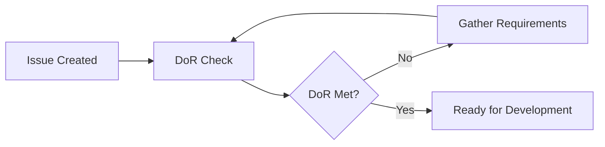
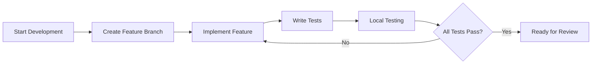
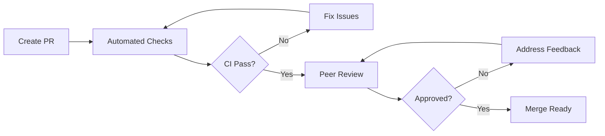
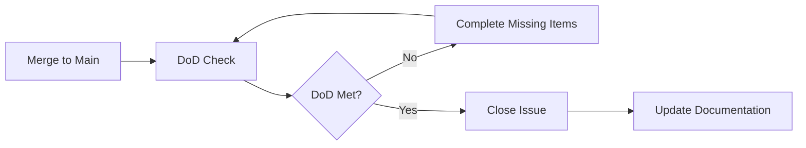

# PROCESS.md - 開發流程規範

> **DoR/DoD | 任務流程 SOP | 測試策略 | PR 流程**

本文件定義背單字 MVP 專案的開發流程標準，確保交付品質與團隊協作效率。

---

## 📋 Table of Contents

1. [Definition of Ready (DoR)](#definition-of-ready-dor)
2. [Definition of Done (DoD)](#definition-of-done-dod)
3. [任務生命週期](#任務生命週期)
4. [開發 SOP](#開發-sop)
5. [測試策略概要](#測試策略概要)
6. [PR 流程標準](#pr-流程標準)
7. [品質檢查清單](#品質檢查清單)
8. [發布流程](#發布流程)

---

## ✅ Definition of Ready (DoR)

### 任務開始前必須滿足的條件

#### 📋 需求明確性
- [ ] **使用者故事完整** - 包含 "As a... I want... So that..." 格式
- [ ] **驗收標準明確** - 具體、可測試的成功條件
- [ ] **設計規格確認** - UI/UX 設計或 API 規格已定案
- [ ] **相依性識別** - 明確列出前置條件與阻礙因素
- [ ] **技術方案討論** - 實作方向已達成共識

#### 🛠 技術準備度
- [ ] **開發環境就緒** - 本地環境可正常執行專案
- [ ] **相關分支更新** - 本地 `main` 分支與遠端同步
- [ ] **測試資料準備** - 需要的 fixtures 或 mock data 已建立
- [ ] **文件存取權限** - 能存取相關規格文件 (SPEC.md)

#### 📏 任務範圍
- [ ] **工作量估算** - 任務複雜度在 1-5 天範圍內
- [ ] **拆分適當** - 大任務已拆分為可獨立交付的小任務
- [ ] **影響範圍明確** - 了解變更對其他功能的潛在影響

### DoR 檢查範例

```markdown
## User Story
**As a** 單字學習者
**I want** 能在卡片間快速切換
**So that** 我可以專注於學習而非操作介面

## Acceptance Criteria
- [ ] 支援鍵盤快捷鍵 (← → Space Enter)
- [ ] 三面切換動畫流暢 (< 300ms)
- [ ] 觸控裝置支援左右滑動
- [ ] 無障礙支援 (ARIA labels)

## Technical Notes
- 使用 Framer Motion 實作動畫
- 整合現有的 Card 組件
- 需更新 CardFace 組件的 props interface

## Dependencies
- [ ] Card 組件重構 (#12) 已完成
- [ ] 無其他阻礙因素

## Estimated Effort
2 days (包含測試撰寫)
```

---

## ✅ Definition of Done (DoD)

### 任務完成必須滿足的條件

#### 💻 程式碼品質
- [ ] **功能實作完整** - 所有驗收標準都已滿足
- [ ] **程式碼審查通過** - 至少一位其他開發者 approve
- [ ] **符合風格規範** - ESLint + Prettier 檢查通過
- [ ] **型別安全** - TypeScript 編譯無錯誤或警告
- [ ] **無 Console 警告** - 開發模式下無未處理的 warnings

#### 🧪 測試完整性  
- [ ] **單元測試撰寫** - 核心邏輯有測試覆蓋
- [ ] **測試通過** - 所有測試 (包含既有測試) 都通過
- [ ] **覆蓋率維持** - 整體覆蓋率不低於目標 (80%)
- [ ] **邊界情況測試** - 錯誤情況與邊界值都有測試

#### 📚 文件更新
- [ ] **程式碼註解** - 複雜邏輯有適當說明註解
- [ ] **API 文件** - 新增/修改的 API 已更新至 SPEC.md
- [ ] **README 更新** - 如有新增指令或配置需求
- [ ] **TESTCASES 更新** - 新功能的驗收案例已記錄

#### 🚀 部署準備
- [ ] **建構成功** - `npm run build` 可正常執行
- [ ] **本地測試** - 開發環境與建構版本都正常運作
- [ ] **瀏覽器相容** - 主要瀏覽器 (Chrome, Firefox, Safari) 測試通過
- [ ] **效能檢查** - 無明顯效能問題或記憶體洩漏

### DoD 檢查範例

```markdown
## Completed Features ✅
- [x] 鍵盤導航實作 (← → Space Enter)
- [x] 三面切換動畫 (使用 Framer Motion)  
- [x] 觸控手勢支援 (左右滑動)
- [x] 無障礙標籤 (ARIA roles & labels)

## Code Quality ✅
- [x] ESLint 檢查通過 (0 errors, 0 warnings)
- [x] TypeScript 編譯成功 (0 errors)
- [x] Prettier 格式化完成
- [x] Code review approved by @reviewer

## Testing ✅  
- [x] Card navigation unit tests (12 test cases)
- [x] Keyboard event handling tests
- [x] Touch gesture tests  
- [x] Accessibility tests (screen reader)
- [x] All existing tests pass (124/124)
- [x] Coverage: 84% (target: 80%)

## Documentation ✅
- [x] Updated SPEC.md with keyboard shortcuts
- [x] Added JSDoc comments for complex animation logic
- [x] Updated TESTCASES.md with navigation scenarios

## Deployment Ready ✅
- [x] Build successful (`npm run build`)
- [x] Dev server runs without errors
- [x] Tested on Chrome 118, Firefox 119, Safari 17
- [x] No performance regressions detected
```

---

## 🔄 任務生命週期

### 1. 計劃階段 (Planning)


**活動清單:**
- 建立 Issue 並填寫完整描述
- 進行 DoR 檢查
- 估算工作量與排程
- 分配給適當的開發者

### 2. 開發階段 (Development)


**時間管理:**
- **每日進度更新** - 在 Issue 中更新進度與阻礙
- **及時求助** - 遇到阻礙超過 4 小時應尋求協助
- **中期檢查** - 任務進行過半時進行自我檢視

### 3. 審查階段 (Review)


**審查重點:**
- 自動化檢查 (CI/CD pipeline)
- 程式碼品質審查
- 功能測試確認
- 文件完整性檢查

### 4. 完成階段 (Done)


**收尾工作:**
- 合併至主分支
- DoD 最終檢查
- 更新專案文件
- 清理開發分支

---

## 🛠 開發 SOP

### 日常開發流程

#### 1. 任務領取
```bash
# 1. 同步最新程式碼
git checkout main
git pull origin main

# 2. 檢查 Issue 的 DoR 狀態
# 3. 確認技術方案與相依性
# 4. 在 Issue 中留言表示開始開發
```

#### 2. 功能開發
```bash
# 1. 建立功能分支
git checkout -b feature/card-navigation

# 2. TDD 開發循環
# 寫測試 → 寫實作 → 重構 → 重複

# 3. 定期提交
git add .
git commit -m "feat(card): add keyboard navigation support"

# 4. 定期推送 (至少每日一次)
git push origin feature/card-navigation
```

#### 3. 自我檢查
```bash
# 開發完成後執行完整檢查
npm run lint          # ESLint 檢查
npm run type-check    # TypeScript 檢查  
npm run test          # 測試執行
npm run test:coverage # 覆蓋率檢查
npm run build         # 建構檢查
```

#### 4. PR 建立
1. 填寫完整的 PR 描述 (使用模板)
2. 自我審查程式碼 (GitHub 的 Files changed 分頁)
3. 確認 CI 檢查通過
4. 請求適當的審查者

### 特殊情況處理

#### 🚨 緊急 Hotfix
```bash
# 1. 從 main 建立 hotfix 分支
git checkout main
git pull origin main
git checkout -b hotfix/cors-error-fix

# 2. 最小化修復
# 僅修復必要部分，避免額外變更

# 3. 快速測試
npm run test
npm run build

# 4. 緊急 PR (簡化審查流程)
# 可由一位 maintainer 快速審查並合併
```

#### 🔄 功能重構
```bash
# 1. 建立 refactor 分支
git checkout -b refactor/srs-algorithm-optimization

# 2. 確保測試先行
# 重構前確保有足夠的測試覆蓋

# 3. 小步重構
# 將大重構拆分為多個小 commit

# 4. 保持功能不變
# 重構不應改變對外介面行為
```

---

## 🧪 測試策略概要

### 測試分層架構

#### 1. 單元測試 (Unit Tests) - 70%
**範圍**: 純函式、工具函式、業務邏輯
```typescript
// 範例: SRS 算法測試
describe('SRS Algorithm', () => {
  describe('nextByLeitner', () => {
    it('should upgrade box on quality 3', () => {
      const card = createTestCard({ box: 1 });
      const result = nextByLeitner(card, 3);
      expect(result.box).toBe(2);
    });
    
    it('should reset to box 1 on quality 1', () => {
      const card = createTestCard({ box: 4 });
      const result = nextByLeitner(card, 1);
      expect(result.box).toBe(1);
    });
  });
});
```

#### 2. 整合測試 (Integration Tests) - 20%
**範圍**: API hooks、組件互動、資料流
```typescript
// 範例: API Hook 測試
describe('useDueCards', () => {
  it('should fetch due cards on mount', async () => {
    const { result } = renderHook(() => useDueCards(), {
      wrapper: QueryClientWrapper
    });
    
    await waitFor(() => {
      expect(result.current.isSuccess).toBe(true);
    });
    
    expect(result.current.data).toHaveLength(3);
  });
});
```

#### 3. 端對端測試 (E2E Tests) - 10%
**範圍**: 關鍵使用者流程
```typescript
// 概念性 E2E 腳本 (使用 Playwright 或 Cypress)
test('Complete card review flow', async ({ page }) => {
  // 1. 載入應用
  await page.goto('/');
  
  // 2. 開始複習
  await page.click('[data-testid="start-review"]');
  
  // 3. 翻看卡片
  await page.keyboard.press('ArrowRight');
  expect(page.locator('[data-testid="card-meaning"]')).toBeVisible();
  
  // 4. 評分
  await page.click('[data-testid="quality-3"]');
  
  // 5. 確認進入下一張
  expect(page.locator('[data-testid="card-counter"]')).toHaveText('2/5');
});
```

### 測試資料管理
```typescript
// test/fixtures/cardFixtures.ts
export const createTestCard = (overrides: Partial<Card> = {}): Card => ({
  id: 'test-1',
  word: { base: 'test', forms: [] },
  posPrimary: 'n.',
  meaning: '測試',
  synonyms: [],
  antonyms: [],  
  example: 'This is a test.',
  anchors: [],
  createdAt: '2025-08-27T00:00:00Z',
  box: 1,
  ease: 2.5,
  reps: 0,
  interval: 0,
  lastReviewedAt: null,
  nextReviewAt: '2025-08-27T00:00:00Z',
  ...overrides
});

export const testCards: Card[] = [
  createTestCard({ id: 'card-1', word: { base: 'ubiquitous', forms: [] } }),
  createTestCard({ id: 'card-2', word: { base: 'ephemeral', forms: [] } }),
  // ... 更多測試資料
];
```

### 測試命名規範
```typescript
// 描述性測試名稱格式：should [expected behavior] when [condition]
describe('MediaEmbed Component', () => {
  it('should render image element when anchor type is image', () => {
    // 測試實作
  });
  
  it('should render YouTube iframe when anchor type is youtube', () => {
    // 測試實作  
  });
  
  it('should handle missing title gracefully', () => {
    // 測試實作
  });
});
```

### 測試執行策略
```bash
# 開發中持續執行
npm run test:watch

# 提交前完整測試  
npm run test
npm run test:coverage

# CI/CD 中執行
npm run test:ci           # 非互動模式
npm run test:e2e          # E2E 測試 (僅在 staging)
```

---

## 🔄 PR 流程標準

### PR 生命週期

#### 1. 建立階段
```markdown
## PR 建立清單
- [ ] 基於最新的 main 分支
- [ ] 單一功能或修復 (避免混合多個變更)
- [ ] 描述完整 (使用 PR 模板)
- [ ] 自我代碼審查完成
- [ ] CI 檢查通過
```

#### 2. 審查階段
**自動檢查 (CI Pipeline):**
- ESLint + Prettier 檢查
- TypeScript 編譯
- 測試執行 + 覆蓋率檢查
- 建構成功驗證

**人工審查重點:**
- 程式碼邏輯正確性
- 設計模式適當性  
- 效能與安全性考量
- 測試完整性

#### 3. 回饋處理
```bash
# 處理審查回饋
git checkout feature/card-navigation
git add .
git commit -m "fix: address PR feedback on error handling"
git push origin feature/card-navigation

# PR 會自動更新，無需建立新的 PR
```

#### 4. 合併標準
**合併前檢查:**
- [ ] 至少一位審查者 approve
- [ ] 所有 CI 檢查通過
- [ ] 無未解決的對話 (conversations)
- [ ] 分支基於最新的 main (如需要會要求更新)

### PR 大小指導原則

#### 🟢 小型 PR (< 200 lines) - 推薦
- 單一 bug 修復
- 小功能新增
- 文件更新
- 配置調整

**優點**: 審查快速、風險低、易於追蹤

#### 🟡 中型 PR (200-500 lines) - 可接受  
- 完整功能模組
- 組件重構
- API 端點實作

**要求**: 詳細描述、充分測試、分階段審查

#### 🔴 大型 PR (> 500 lines) - 避免
- 大規模重構
- 多功能混合
- 架構變更

**建議**: 拆分為多個相關的小 PR

### 合併策略
```bash
# 使用 Squash and Merge (推薦)
# 將多個 commits 合併為單一有意義的 commit

# 合併後的 commit message 格式
feat(card): implement three-face navigation system

- Add keyboard shortcuts (← → Space Enter)
- Support touch gestures for mobile devices  
- Include accessibility labels for screen readers
- Add comprehensive test coverage

Closes #23
```

---

## 📋 品質檢查清單

### 開發階段檢查

#### 💻 程式碼品質
```bash
# 執行檢查指令
npm run lint              # ESLint 規則檢查
npm run type-check        # TypeScript 型別檢查
npm run format            # Prettier 格式化
npm run audit             # 安全性漏洞檢查
```

**檢查重點:**
- [ ] 無 ESLint errors 或 warnings
- [ ] 無 TypeScript 編譯錯誤
- [ ] 程式碼格式一致 (Prettier)
- [ ] 無已知安全性漏洞

#### 🧪 測試品質
```bash
# 測試相關檢查
npm run test              # 所有測試通過
npm run test:coverage     # 覆蓋率達標
npm run test:watch        # 開發過程持續測試
```

**覆蓋率目標:**
- **整體覆蓋率**: ≥ 80%
- **關鍵模組**: ≥ 90% (SRS 算法、API 層)
- **UI 組件**: ≥ 70% (重點在互動邏輯)

#### 🚀 效能檢查
```bash
# 建構與效能檢查
npm run build             # 建構成功
npm run analyze           # Bundle 大小分析 (如有配置)
```

**效能指標:**
- [ ] 建構檔案大小合理 (< 1MB gzipped)
- [ ] 無明顯記憶體洩漏
- [ ] 關鍵操作響應時間 < 100ms

### 提交前檢查

#### 📝 提交品質
```bash
# Git 相關檢查
git status                # 確認暫存狀態
git diff --cached         # 審查即將提交的變更
npm run pre-commit        # 執行 pre-commit hooks (如有)
```

**提交標準:**
- [ ] 提交訊息遵循 Conventional Commits
- [ ] 每個 commit 都是完整的功能單元
- [ ] 無調試用的 console.log 或註解
- [ ] 敏感資訊已移除 (API keys, passwords)

#### 📚 文件品質
- [ ] 新增功能已更新 SPEC.md
- [ ] API 變更已更新相關文件
- [ ] README 中的指令仍然有效
- [ ] 註解與實作程式碼保持同步

---

## 🚀 發布流程

### 版本管理策略

#### 語意化版本 (Semantic Versioning)
```
MAJOR.MINOR.PATCH
  1  .  2  .  3

MAJOR: 破壞性變更 (API 不向下相容)
MINOR: 新功能 (向下相容)  
PATCH: 錯誤修復 (向下相容)
```

#### 版本範例
- `v0.1.0` - 初始 MVP 版本
- `v0.1.1` - 修復卡片切換 bug
- `v0.2.0` - 新增 LLM 建議功能
- `v1.0.0` - 第一個正式版本

### 發布檢查清單

#### 🔍 發布前驗證
- [ ] 所有預定功能都已實作並測試
- [ ] 無已知的嚴重 bug (severity: high/critical)
- [ ] 效能表現符合預期
- [ ] 相容性測試通過 (多瀏覽器)
- [ ] 文件已更新至最新狀態

#### 📦 發布準備
```bash
# 1. 確保 main 分支是最新的
git checkout main
git pull origin main

# 2. 執行完整測試套件
npm run test:ci
npm run test:e2e        # 如有設定

# 3. 建構生產版本
npm run build

# 4. 版本標記
npm version minor       # 自動更新 package.json 並建立 git tag
git push origin main --tags

# 5. 部署 (依據部署策略)
npm run deploy          # 或使用 CI/CD pipeline
```

#### 🔄 發布後驗證
- [ ] 生產環境功能正常運作
- [ ] 關鍵指標無異常 (錯誤率、回應時間)
- [ ] 使用者回饋監控
- [ ] 備份與回滾方案準備就緒

### Hotfix 流程
```bash
# 緊急修復流程 (跳過一般開發週期)
git checkout main
git checkout -b hotfix/critical-bug-fix

# 最小化修復
git add .
git commit -m "fix: resolve critical authentication bug"

# 緊急合併 (簡化審查)
git checkout main  
git merge hotfix/critical-bug-fix
npm version patch
git push origin main --tags

# 立即部署
npm run deploy
```

---

## 📊 流程改進

### 指標追蹤
- **開發週期時間** - 從 DoR 到 DoD 的平均時間
- **缺陷密度** - 每 1000 行程式碼的 bug 數量
- **測試覆蓋率** - 維持在目標範圍內
- **PR 審查時間** - 平均審查回應時間

### 定期回顧
- **每週回顧** - 檢視流程執行狀況與改進點
- **每月總結** - 分析指標趨勢與流程優化
- **季度評估** - 整體流程效果評估與大幅調整

### 流程優化原則
1. **自動化優先** - 能自動化的檢查都應該自動化
2. **快速回饋** - 問題越早發現越容易修復
3. **持續改進** - 根據實際使用經驗調整流程
4. **工具支援** - 善用工具減少手工作業

---

**此流程規範為活文件，將根據團隊實際使用經驗持續更新優化。** 📈

有任何流程改進建議，歡迎在團隊會議或 Issue 中提出討論。